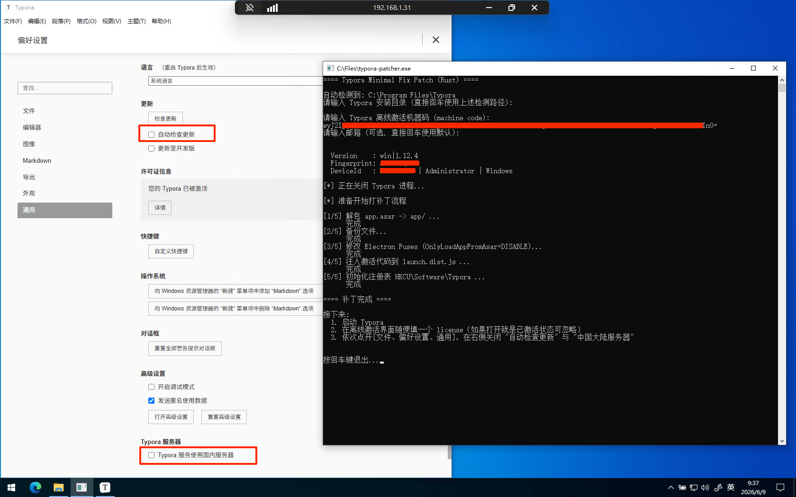

# typora-patcher

Typora 激活工具，仅适用于`1.12.4`版本

## 原版JS激活工具

前段时间在网上找到个 Typora 激活工具`crack-minimal-fix.js`，使用方法如下所示：

**前置条件：安装node包管理器**

1. [typora-setup-x64-1.12.4.exe](https://downloads.typoraio.cn/windows/typora-setup-x64-1.12.4.exe)（Windows版本）正常安装 ，打开软件后在任务栏中关闭程序（其他系统的版本可以到[Typora — stable release channel](https://typoraio.cn/releases/stable.html)）
2. 克隆当前项目到本地或者下载[typora-patcher/files/crack-minimal-fix.js at master · z-hanzhe/typora-patcher](https://github.com/z-hanzhe/typora-patcher/blob/master/files/crack-minimal-fix.js)，然后将**crack-minimal-fix.js** 复制到在 typora 安装目录
3. 将 crack-minimal-fix.js 第 243 行位置，将原本的地址更换为 typora 安装目录地址
4. 在 activate 依次执行以下命令：

  - npm init -y
  - npm install asar chalk@4 readline-sync winreg @electron/fuses
  - node crack-minimal-fix.js
5. 再次打开 typora 选择离线激活，复制机器码到 cli 中进行激活
6. 如果输入激活码报错 app.asar 等字样，手动删除 typora 安装目录下的 resources 文件夹后重新激活即可
7. 激活后关闭 typora 的 **“自动检查更新”** 与 **“Typora 服务使用国内服务器”** 选项

## 改版可执行文件

上面的激活工具是可用的，不过由于他是 JS 文件，需要本机安装 node npm 才能执行并不是很方便，尤其对不懂编程的人很不友好，所以我拷打 AI 改了一份 Rust 版本，可编译为 exe 文件直接双击执行，执行流程和上面一致，只不过把第四部繁琐的步骤改成双击执行即可

